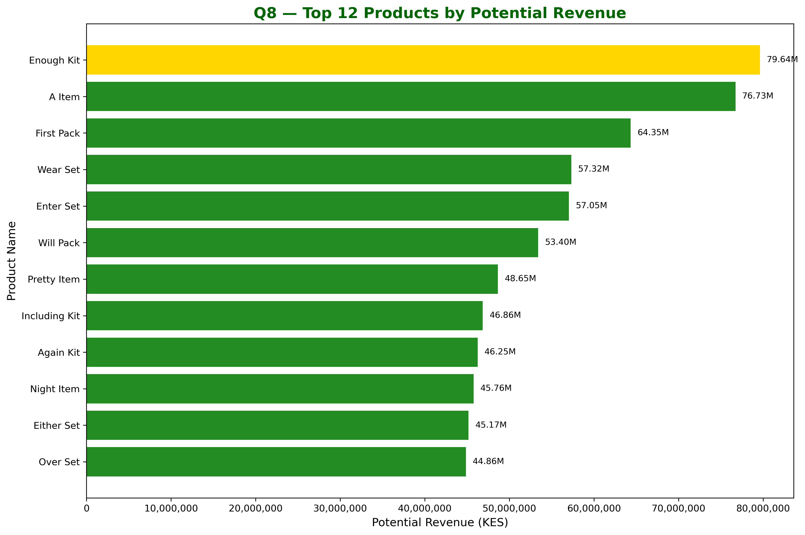
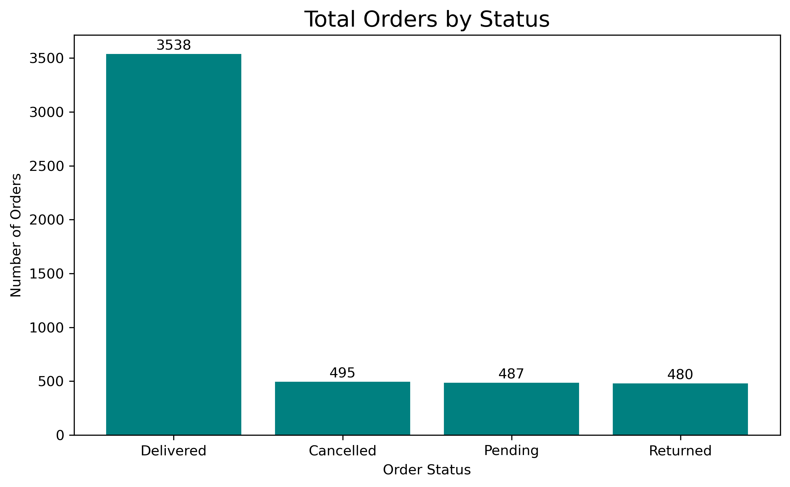

# Veritas Data Services: Jumia E-commerce Data Analysis Portfolio

## Executive Summary and Project Goals

This portfolio project presents a comprehensive data analysis of a synthetic e-commerce dataset designed to model the transaction and customer behavior patterns of a major retailer such as Jumia. The analysis, conducted by Veritas Data Services, transforms raw operational and customer data into actionable business intelligence across 14 key analytical questions.

## Project Goals and Analysis Pillars

1. Customer Value (Q1, Q11, Q12): Identify the most profitable customer segments and calculate long-term value metrics (LTV, RFM) to guide retention and acquisition strategies.

2. Operational Efficiency (Q3, Q5, Q7, Q14): Diagnose inefficiencies in fulfillment, order handling, and platform-specific payment performance.

3. Strategic Portfolio Management (Q8, Q9, Q13): Identify top-performing products and categories, understand inventory distribution, and map strategic product quadrants.

## Methodology Note

This dataset was synthetically generated to simulate realistic e-commerce behavior. A deliberate omission - the absence of an order_items table - introduces a real-world analytical challenge. For Question 10 (Returns), we demonstrate how to provide approximate insights using structured assumptions, similar to common practice in real analytics engagements.

-------------------------------------------------------------

# CUSTOMER INSIGHTS

## Q1. Customer Growth Over Time

### Insight
Customer signups show a clear upward trend, confirming strong acquisition momentum. Seasonal rises suggest effective promotional campaigns, while dips reflect natural buying cycles. This steady growth establishes a solid foundation for future retention efforts.

### Recommendation
Strengthen promotional activity during identified peak acquisition months and investigate dips for optimization opportunities.

### Conclusion
Customer acquisition efforts are successful and scaling consistently.

-------------------------------------------------------------

## Q2. Top 20 Customer Locations

### Insight
Customer distribution is concentrated in major urban and semi-urban cities such as Meru, Kitale, and Mombasa. These serve as operational and marketing hotspots.

### Recommendation
Focus marketing spend and inventory planning on the top 20 cities to maximize ROI and fulfillment efficiency.

### Conclusion
A concentrated regional footprint offers clarity for targeted expansion.

-------------------------------------------------------------

# ORDER INSIGHTS

## Q3. Monthly Order Volume Trend

### Insight
Order volume shows strong seasonal peaks, especially toward year-end. This confirms the importance of holidays and promotions as major drivers of demand.

### Recommendation
Prepare inventory, staffing, and logistics ahead of peak seasons to avoid bottlenecks.

### Conclusion
Seasonality is a key driver in operational planning.

-------------------------------------------------------------

## Q4. Platform Performance (App vs Web)

### Insight
The App generates higher revenue and a stronger average order value compared to Web. However, order volume remains balanced across both platforms.

### Recommendation
Prioritize App enhancements while maintaining an optimized Web experience to ensure broad accessibility.

### Conclusion
Both platforms are essential, but the App is the main revenue engine.

-------------------------------------------------------------

## Q5. Order Status Breakdown

### Insight
A delivery success rate of 70.76 percent reflects strong fulfillment performance. However, Cancelled and Pending orders represent nearly 20 percent of all transactions, indicating potential friction points.

### Recommendation
Analyze reasons for cancellations and pending states to reduce lost revenue.

### Conclusion
Fulfillment is strong, but cancellations provide a clear improvement area.

-------------------------------------------------------------

# PAYMENT INSIGHTS

## Q6. Payment Method Split (Completed Payments)

### Insight
Completed payments are nearly evenly split between M-Pesa and Card, indicating diverse customer payment preferences.

### Recommendation
Continue optimizing both payment funnels equally to avoid dependence on a single method.

### Conclusion
A balanced payment ecosystem supports customer convenience.

-------------------------------------------------------------

## Q7. Payment Status Breakdown by Method

### Insight
Most transactions are successful, but the absolute number of failed payments signals real revenue leakage.

### Recommendation
Investigate error logs and collaborate with payment providers to reduce failure rates.

### Conclusion
The system is reliable, but minimizing failures will directly increase revenue.

-------------------------------------------------------------

# PRODUCT INSIGHTS

## Q8. Top 12 Products by Potential Revenue

### Insight
A small set of SKU products dominates potential revenue, showing heavy concentration in the inventory value.

### Recommendation
Secure supply chains for top SKUs and promote high-potential secondary products.

### Conclusion
Protecting top SKUs is essential to revenue stability.

-------------------------------------------------------------

## Q9. Category Performance Analysis

### Insight
Fashion, Electronics, and Groceries dominate stock, product count, and inventory value. Potential revenue is used due to missing item-level sales data.

### Recommendation
Future datasets should include an order_items table to validate category performance.

### Conclusion
Inventory value is concentrated in a few categories that shape merchandising priorities.

-------------------------------------------------------------

# CROSS ANALYSIS

## Q10. Returns by Category (Approximation)

### Insight
480 orders were returned. Due to missing product-link tables, category-level insight is approximate.

### Recommendation
Include item-level return data in future datasets to enable proper category analysis.

### Conclusion
Even approximate analysis highlights the need for improved quality control for high-value categories.

-------------------------------------------------------------

# CUSTOMER VALUE METRICS

## Q11. Customer Lifetime Value (LTV)

### Insight
LTV follows a long-tail distribution. Most customers spend modest amounts, while a small elite group contributes heavily to total revenue.

### Recommendation
Implement VIP retention programs to preserve high-LTV customers.

### Conclusion
A small customer segment drives business profitability.

-------------------------------------------------------------

## Q12. Customer Segmentation (RFM Analysis)

### Insight
Champions and Loyal Customers form the strongest revenue core, while Lost and At-Risk customers represent churn risk.

### Recommendation
Apply segmented retention strategies and win-back campaigns targeted at At-Risk and Lost groups.

### Conclusion
RFM segmentation creates an actionable customer roadmap.

-------------------------------------------------------------

# PRODUCT STRATEGY

## Q13. High-Value vs High-Volume Quadrant Analysis

### Insight
Products distribute cleanly into four quadrants: premium assets, targeted marketing items, efficiency-focused stock, and potential phase-outs.

### Recommendation
Prioritize premium quadrant products and reduce low-value, low-volume items.

### Conclusion
Quadrant mapping offers a clear strategy for inventory decisions.

-------------------------------------------------------------

# PAYMENT FLOW OPTIMIZATION

## Q14. Payment Success by Method and Platform

### Insight
Certain payment and platform combinations show higher failure rates. Web and Card show the highest friction.

### Recommendation
Prioritize debugging for high-failure combinations first.

### Conclusion
Fixing specific payment flaws can significantly increase captured revenue.

-------------------------------------------------------------

# DASHBOARDS

-------------------------------------------------------------

# Final Strategic Summary

1. Customer Value: High-LTV customers drive revenue. Retain and grow these relationships.
2. Product Portfolio: Key categories dominate inventory value. Strengthen quality and clarity in these areas.
3. Operational Efficiency: Address cancellation and payment failures for immediate revenue gains.

-------------------------------------------------------------

© Veritas Data Services - All Rights Reserved, 2025
