# Veritas Data Services: Jumia E-commerce Data Analysis Portfolio

## Executive Summary and Project Goals

This portfolio project presents a **comprehensive data analysis** of a synthetic e-commerce dataset, designed to model the transaction and customer behavior patterns of a major retailer like Jumia. The analysis, conducted by **Veritas Data Services**, focuses on transforming raw data across 14 key business questions into **actionable intelligence**.

### Methodology Note

The dataset utilized for this analysis is **synthetic** and was programmatically generated. A core feature of the analysis is demonstrating how to derive insights (Q10) even when faced with common real-world **data limitations**, such as the absence of a direct **`order_items` table**.

---

## Key Operational KPIs & Health Check

| Metric | Finding | Health Status |
| :--- | :--- | :--- |
| **Delivery Success Rate (Q5)** | High percentage of orders successfully delivered. | **Stable** |
| **Payment Success Rate (Q7, Q14)**| High overall success rate, but failures cluster in specific platform/method combinations. | **Good (Needs Optimization)** |
| **Order Status Concern (Q5)** | Cancellations remain the highest category of non-delivered orders. | **Warning** |

---

## Project Analysis & Visualizations

###  Customer Insights
| Question | Focus | Chart |
| :--- | :--- | :--- |
| **Q1.** Customer Growth Over Time | Acquisition Trend | [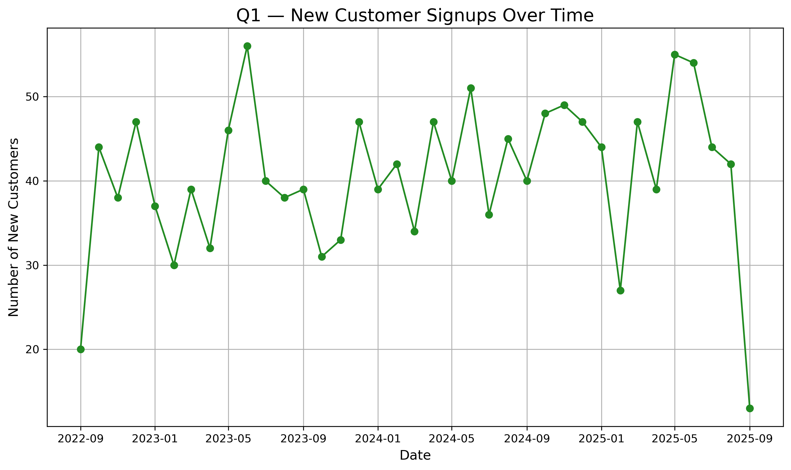](charts_output/q1_customer_growth.png) |
| **Q2.** Top Customer Locations | Regional Demand Hotspots | [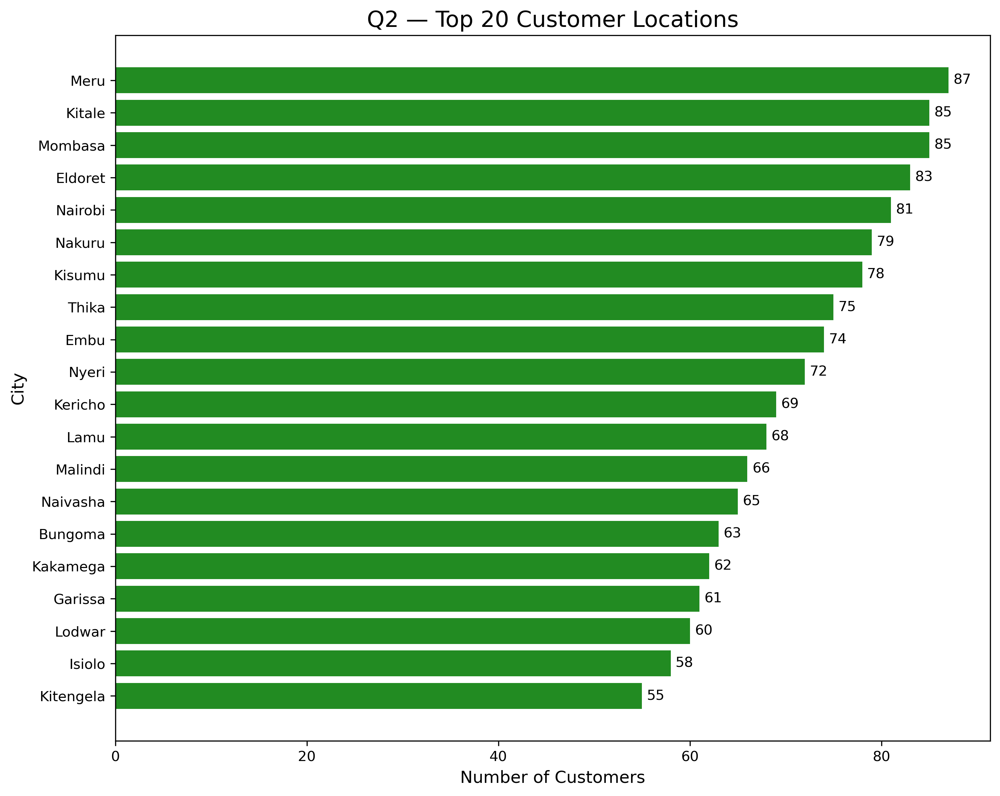](charts_output/Q2top_customer_cities_20.png) |
| **Q11.** Customer Lifetime Value (LTV) | Revenue Distribution | [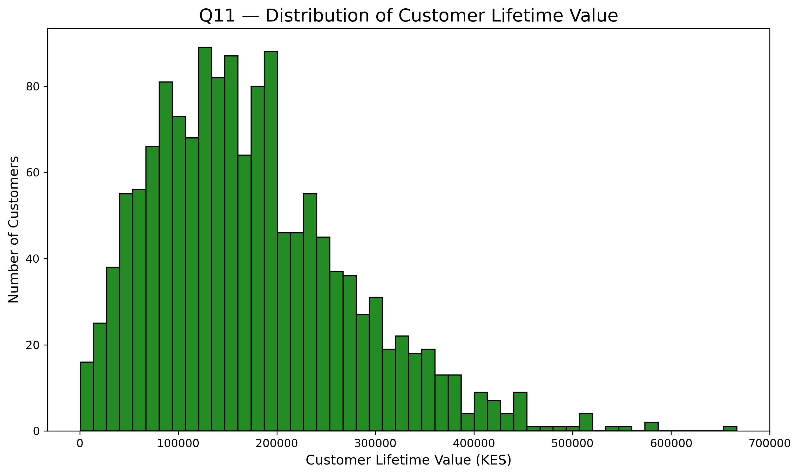](charts_output/Q11customer_ltv_distribution.png) |
| **Q12.** Customer Segmentation (RFM) | High-Value Customer Groups | [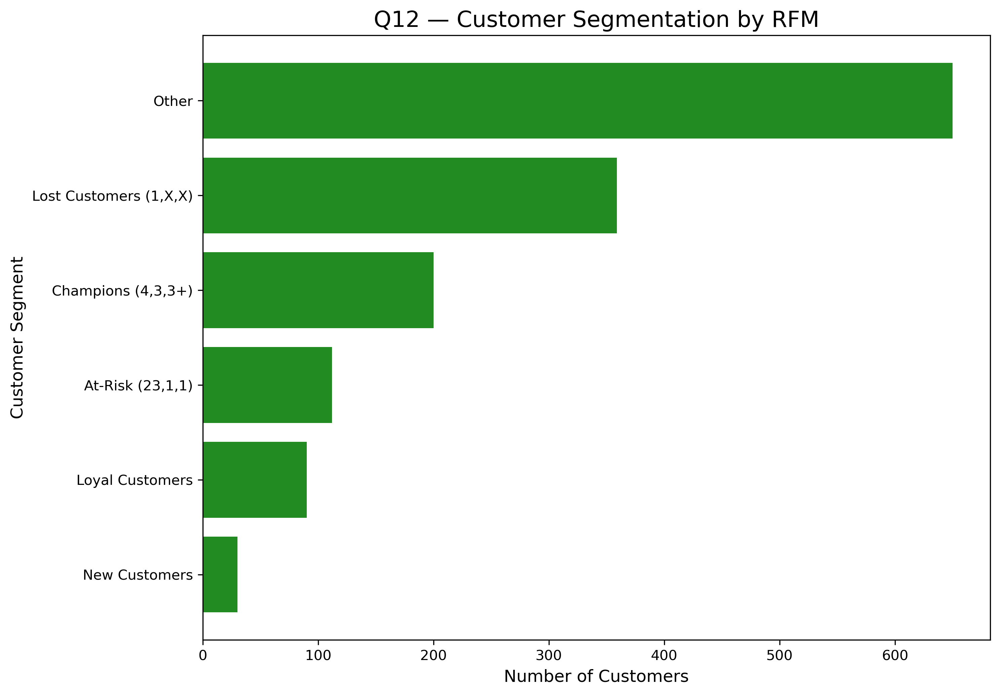](charts_output/Q12RFM_segmentation.png) |

###  Order & Payment Insights
| Question | Focus | Chart |
| :--- | :--- | :--- |
| **Q3.** Monthly Order Volume Trend | Seasonal Demand | [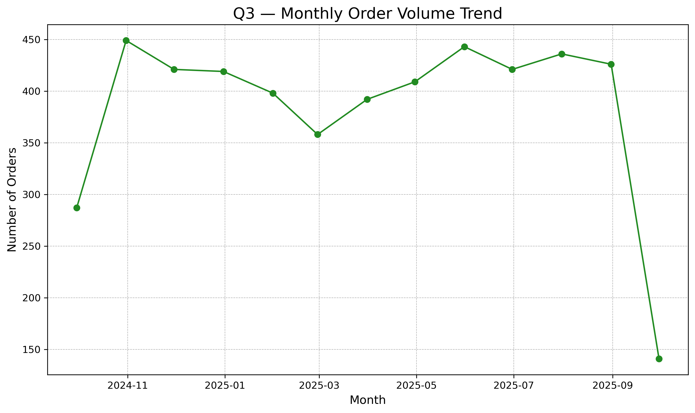](charts_output/Q3monthly_order_volume.png) |
| **Q4.** Platform Performance | Channel Strategy (Orders, Revenue, AOV) | [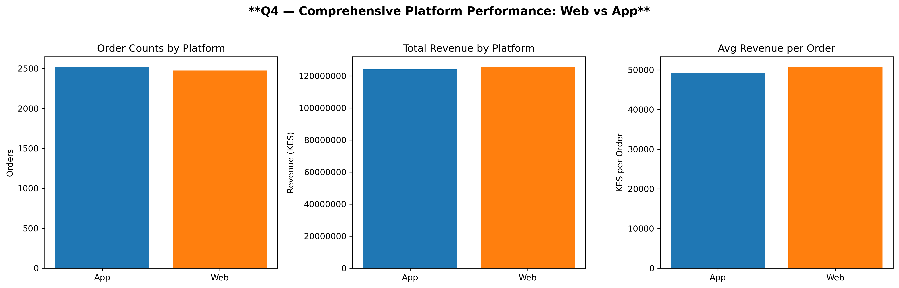](charts_output/q4_platform_performance.png) |
| **Q5.** Order Status Breakdown | Operational KPI (Delivered vs Cancelled) | [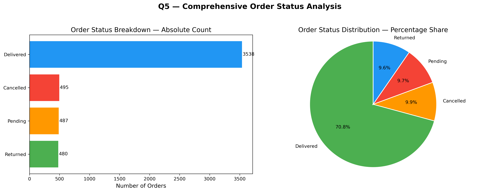](charts_output/Q5order_status_breakdown_combined.png) |
| **Q6.** Payment Method Split | Customer Preference (M-Pesa vs Card) | [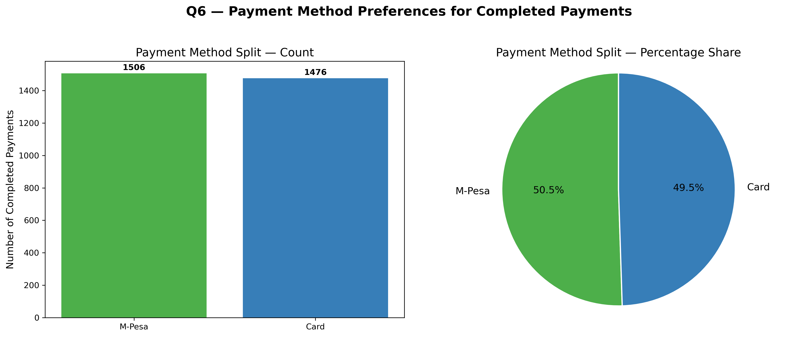](charts_output/Q6payment_method_split_combined.png) |
| **Q7.** Payment Status Breakdown | Success, Failed, Pending Counts by Method |  |
| **Q14.** Payment Success by Method & Platform | Cross-Analysis of Failure Hotspots | [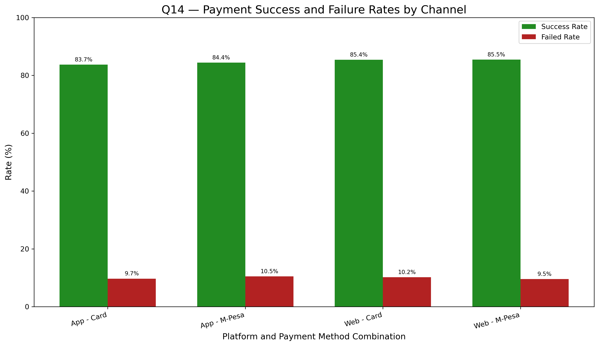](charts_output/Q14payment_success_by_platform.png) |

###  Product & Cross Analysis
| Question | Focus | Chart |
| :--- | :--- | :--- |
| **Q8.** Top Selling Products | High SKU Concentration by Potential Revenue |  |
| **Q9.** Category Performance | Dominant Categories by Inventory Value | [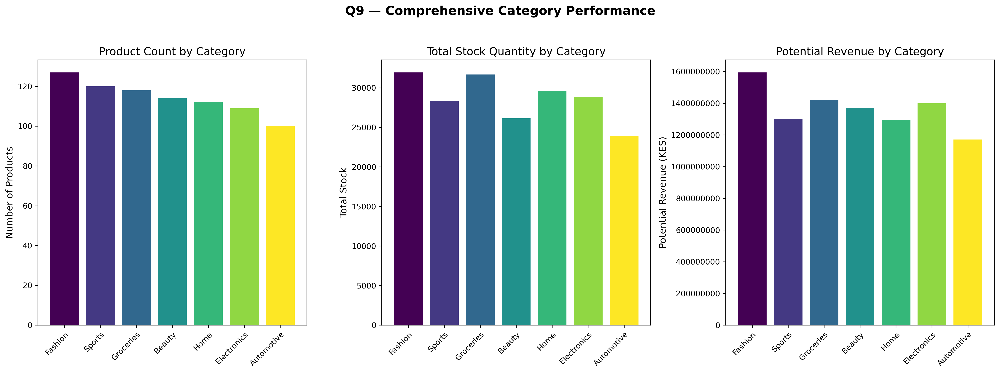](charts_output/Q9category_performance.png) |
| **Q13.** High-Value vs High-Volume Products | Strategic Portfolio Quadrant Analysis | [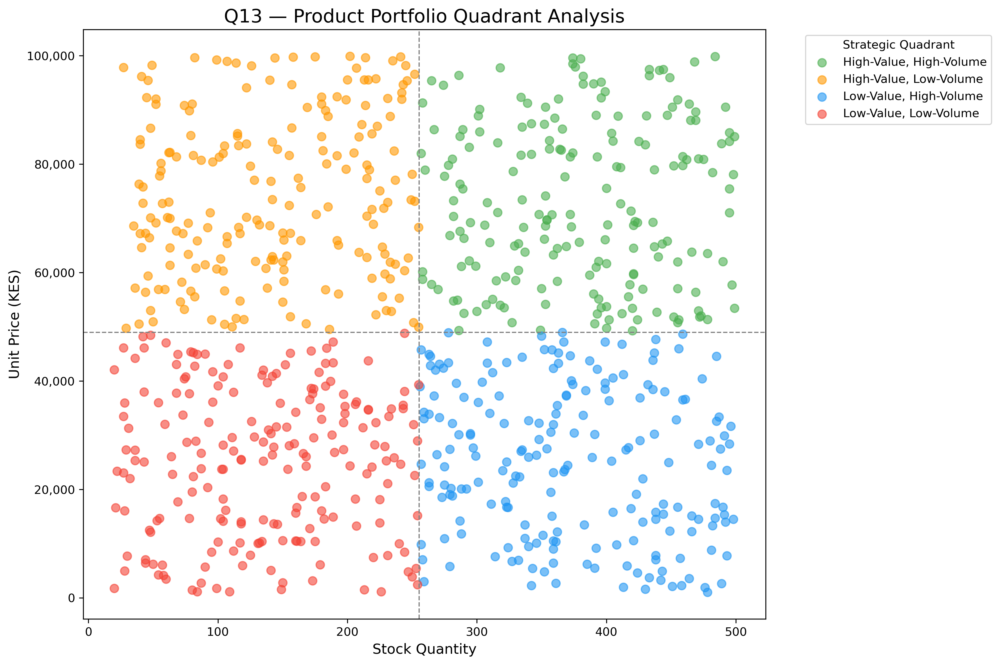](charts_output/Q13highvalue_vs_highvolume_products.png) |
| **Q10.** Returns by Category (Approx.) | Estimate Return Hotspots (Data Limitation Demo) |  |

---

## Final Summary & Strategic Recommendations

#### 1. Customer Value & Retention Strategy
**Insight:** LTV and RFM analysis confirms that a **small segment of Champions drives the majority of revenue**, making customer retention the most crucial priority.

**Recommendation:**
* **Segmented Retention:** Implement a dedicated loyalty program for **'Champions'** to secure their high spend. Focus re-engagement campaigns on **'At-Risk'** customers.

#### 2. Operational & Platform Optimization
**Insight:** The business is well-supported by a balanced platform mix. However, the cross-analysis (Q14) shows payment friction is not random; it clusters in specific channels, and **Cancellations** are the top non-delivered order status.

**Recommendation:**
* **Targeted Tech Audit:** Immediately investigate the specific platform-payment combinations (e.g., **Card on Web**) that exhibit the highest failure rates.
* **Fulfillment Efficiency:** Review the workflow for all **Cancelled** orders (Q5) to pinpoint the exact time-of-cancellation to reduce operational costs.

#### 3. Product Portfolio & Inventory
**Insight:** The portfolio is dominated by specific high-value categories, but these categories are estimated to be return revenue hotspots (Q10).

### Q10. Analysis of Order Returns

**Overall Return Volume**  
Our analysis of the `jumia_orders` table shows a total of **480 orders** have a status of "Returned".

##  Interactive Tableau Dashboard  
Explore the complete visual storytelling and insights in Tableau Public:  
👉 [View the Project on Tableau Public](https://public.tableau.com/views/JumiaSalesCustomerInsightsVeritasDataServices_17612746226440/IntroductoryStory?:language=en-GB&:sid=&:redirect=auth&:display_count=n&:origin=viz_share_link)

**Returns by Category (Blocked)**  
**Key Finding:** It is not possible to determine which product categories face the highest return rates.  
**Reason:** The data to link an `order_id` (from `jumia_orders`) to a `product_id` (from `jumia_products`) is not available.  
A connecting table, such as `order_items.csv`, is required to complete this analysis.

**Recommendation:**
* **Profit Protection:** Implement high-resolution QC processes for the top-returning categories, focusing on **standardized sizing charts for Fashion** and detailed tech specs for Electronics.

***
