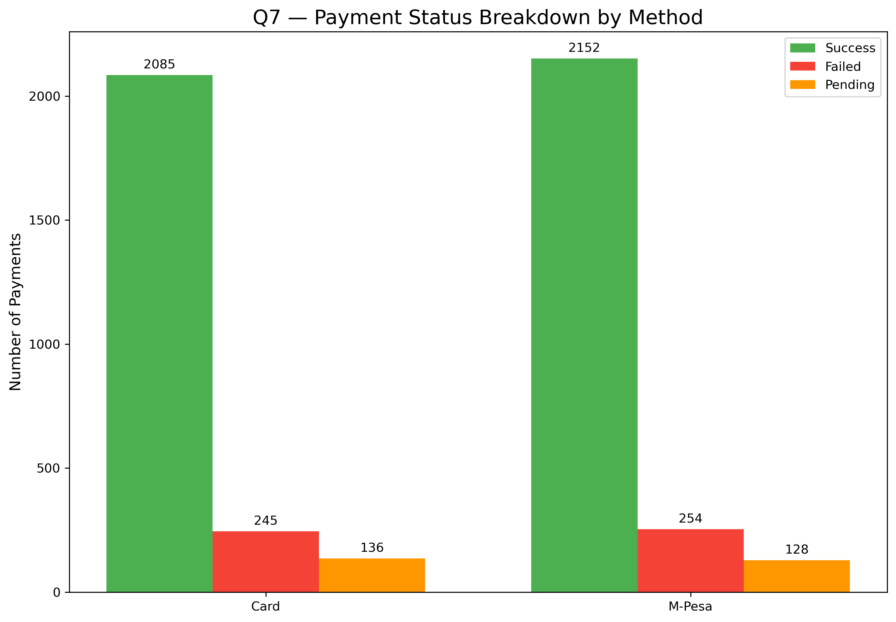

# Veritas Data Services: Jumia E-commerce Data Analysis Portfolio

## Executive Summary and Project Goals

This portfolio project presents a **comprehensive data analysis** of a synthetic e-commerce dataset, designed to model the transaction and customer behavior patterns of a major retailer like Jumia. The analysis, conducted by **Veritas Data Services**, focuses on transforming raw data across 14 key business questions into **actionable intelligence**.

### Methodology Note

The dataset utilized for this analysis is **synthetic** and was programmatically generated. A core feature of the analysis is demonstrating how to derive insights (Q10) even when faced with common real-world **data limitations**, such as the absence of a direct **`order_items` table**.

---

## Key Operational KPIs & Health Check

| Metric | Finding | Health Status |
| :--- | :--- | :--- |
| **Delivery Success Rate (Q5)** | High percentage of orders successfully delivered. | **Stable** |
| **Payment Success Rate (Q7, Q14)**| High overall success rate, but failures cluster in specific platform/method combinations. | **Good (Needs Optimization)** |
| **Order Status Concern (Q5)** | Cancellations remain the highest category of non-delivered orders. | **Warning** |

---

## Project Analysis & Visualizations

###  Customer Insights
| Question | Focus | Chart |
| :--- | :--- | :--- |
| **Q1.** Customer Growth Over Time | Acquisition Trend |  |
| **Q2.** Top Customer Locations | Regional Demand Hotspots |  |
| **Q11.** Customer Lifetime Value (LTV) | Revenue Distribution |  |
| **Q12.** Customer Segmentation (RFM) | High-Value Customer Groups |  |

###  Order & Payment Insights
| Question | Focus | Chart |
| :--- | :--- | :--- |
| **Q3.** Monthly Order Volume Trend | Seasonal Demand |  |
| **Q4.** Platform Performance | Channel Strategy (Orders, Revenue, AOV) |  |
| **Q5.** Order Status Breakdown | Operational KPI (Delivered vs Cancelled) |  |
| **Q6.** Payment Method Split | Customer Preference (M-Pesa vs Card) |  |
| **Q7.** Payment Status Breakdown | Success, Failed, Pending Counts by Method |  |
| **Q14.** Payment Success by Method & Platform | Cross-Analysis of Failure Hotspots |  |

###  Product & Cross Analysis
| Question | Focus | Chart |
| :--- | :--- | :--- |
| **Q8.** Top Selling Products | High SKU Concentration by Potential Revenue |  |
| **Q9.** Category Performance | Dominant Categories by Inventory Value |  |
| **Q13.** High-Value vs High-Volume Products | Strategic Portfolio Quadrant Analysis |  |
| **Q10.** Returns by Category (Approx.) | Estimate Return Hotspots (Data Limitation Demo) |  |

---

## Final Summary & Strategic Recommendations

### 1. Customer Value & Retention Strategy
**Insight:** LTV and RFM analysis confirms that a **small segment of Champions drives the majority of revenue**, making customer retention the most crucial priority.

**Recommendation:**
* **Segmented Retention:** Implement a dedicated loyalty program for **'Champions'** to secure their high spend. Focus re-engagement campaigns on **'At-Risk'** customers through personalized offers and win-back promotions. Use RFM segments to tailor frequency and content of outreach.

**Conclusion:**
A targeted retention strategy for high-value customers will deliver the optimal long-term ROI. Begin with low-cost loyalty pilots and scale based on response metrics.

---

### 2. Operational & Platform Optimization
**Insight:** The business is well-supported by a balanced platform mix. However, the cross-analysis (Q14) shows payment friction is not random; it clusters in specific channels, and **Cancellations** are the top non-delivered order status.

**Recommendation:**
* **Targeted Tech Audit:** Investigate the platform-payment combinations (e.g., Card on Web) with high failure rates; prioritize fixes that unblock the most revenue.
* **Fulfillment Efficiency:** Map cancellation timing and reasons to identify operational chokepoints. Implement lightweight automation to detect and resolve repeat cancellation patterns.

**Conclusion:**
Optimizing the payment and fulfillment flows in the top-failure channels will recover revenue and reduce operational cost.

---

### 3. Product Portfolio & Inventory
**Insight:** The portfolio is dominated by specific high-value categories; available evidence suggests these categories are likely return revenue hotspots (see Q10 limitations).

**Recommendation:**
* **Profit Protection:** Introduce higher QA standards for the suspected high-return SKUs (e.g., more detailed sizing charts, improved product descriptions, better image quality).
* **Inventory Strategy:** For high-value/low-volume lines, prioritize quality controls and reserve premium pick/pack slots; for high-volume/low-value SKUs, optimize turnover and price promotions.

**Conclusion:**
Targeted product quality checks and category-specific inventory rules will protect margins while improving customer satisfaction.

---

## Q10. Analysis of Order Returns

**Overall Return Volume**  
Our analysis of the `jumia_orders` table shows a total of **480 orders** have a status of "Returned".

**Returns by Category (Blocked)**  
**Key Finding:** It is not possible to determine which product categories face the highest return rates using `jumia_orders` alone due to the absence of a linking `order_items` table. A connecting table (e.g., `order_items.csv`) is required to map order-level returns to product-level categories.

**Recommendation:**
* **Instrument Order-Item Links:** For future datasets, ensure inclusion of `order_items` or equivalent so returns can be traced to SKUs and categories. Meanwhile, prioritize operational QA on the highest-value categories as a conservative mitigation.

---

## Tableau Dashboards (static screenshots)

Below are static screenshots of the dashboards used for interactive exploration. These images are embedded as raw PNG snapshots.

  
  
  
  
  

---

## Limitations & Data Notes

- **Missing `order_items` table:** The dataset intentionally lacks the `order_items` linkage, which prevents precise SKU-level return attribution. All return-category estimates are therefore clearly labeled as approximate or blocked where appropriate.  
- **Synthetic data:** The dataset is synthetic for learning purposes; treat absolute scale values as illustrative rather than production-calibrated.  
- **Assumptions:** Any derived metrics (e.g., estimated returns per category) are accompanied by explicit caveats in the analysis.

---

## Author & License

**Veritas Data Services** — Jumia E-commerce Data Analysis  
© 2025 Veritas Data Services — All Rights Reserved
